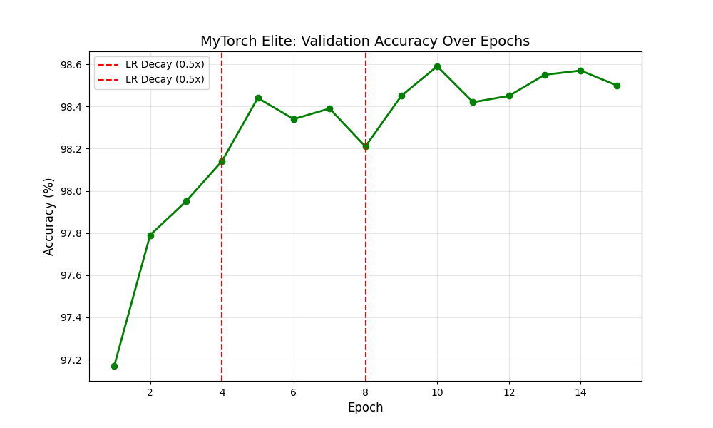
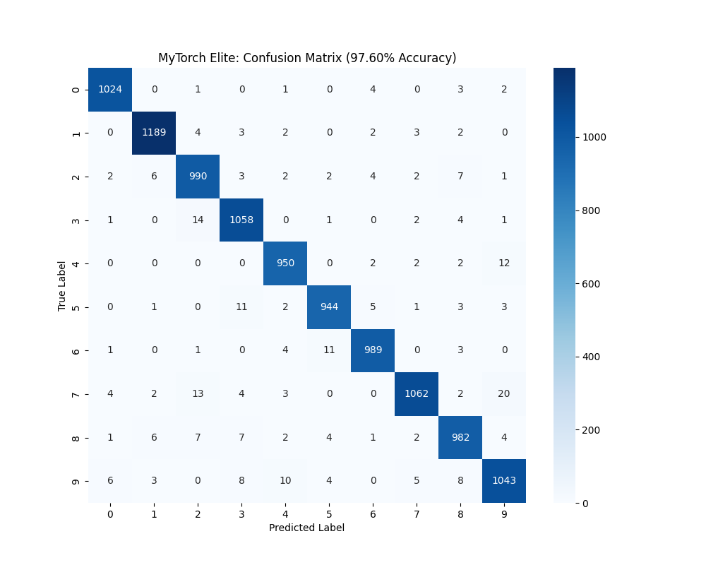
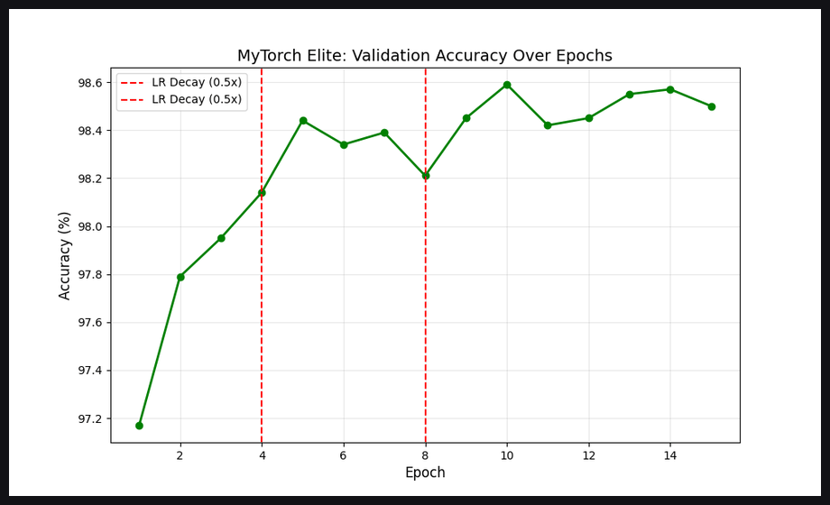
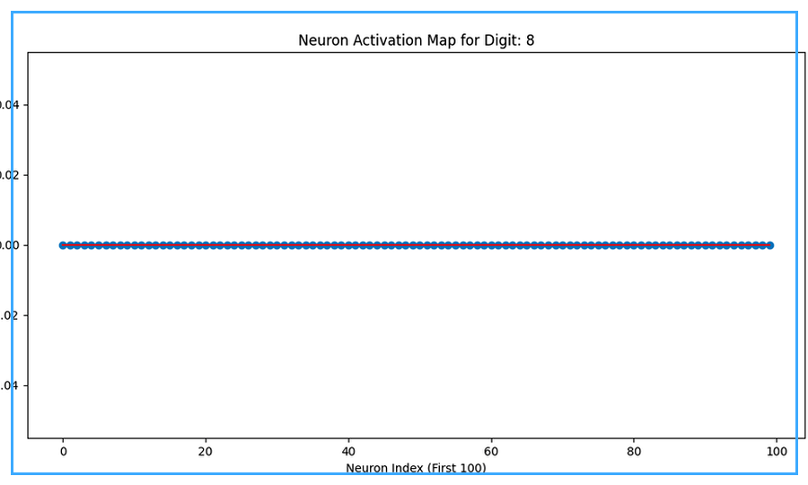

# MyTorch-MNIST-Elite


A high-performance, from-scratch deep learning framework inspired by PyTorch and optimized for MNIST experimentation, now designed for lightweight R-based Kaggle training plus Hugging Face checkpoint storage.

## Description

MyTorch-MNIST-Elite is your custom research playground for:
- building neural-net layers and optimizers from scratch,
- training fast on Kaggle with lightweight R workflows,
- versioning best checkpoints to your Hugging Face model repo,
- visualizing model behavior with rich plots and animated summaries.

This repo is structured to help you iterate quickly, publish results, and scale toward a stronger "MyTorch" ecosystem.

## Tags

`mytorch` `numpy` `deep-learning` `mnist` `kaggle` `rstats` `huggingface` `checkpointing` `neural-networks` `from-scratch` `research`

## Visual Preview

### Core Visuals




### Custom GIFs




## Project Layout

```text
mytorch/                     # Core framework modules (nn + optim)
scripts/
  logger.py                  # Experiment manager + logging
  hf_checkpoint.py           # HF checkpoint upload/download utility
  generate_results_report.py # Auto-generate docs/RESULTS.md from outputs
  setup_hf_space.py          # Create/update HF Space from local folder
  train_mnist_lightweight_kaggle.R
hf_space/
  app.py                     # Gradio demo app for HF Space
  requirements.txt
notebooks/
  MyTorch_MNIST_Kaggle_R.ipynb
  MyTorch_HF_Checkpoint_Workflow.ipynb
docs/
  FEATURES.md
  TECHNICAL.md
  KAGGLE.md
  DEPLOYMENT.md
  RESULTS.md
  SHOWCASE.md
  ROADMAP.md
outputs/
  metrics.json
  run_metadata.json
visuals/
  *.png
  gifs/*.gif
```

## Quick Start

### 1) Environment setup

```bash
pip install -r requirements.txt
```

### 2) Hugging Face auth (for checkpoint sync)

```bash
huggingface-cli login
```

or set environment variable:

```bash
export HF_TOKEN=your_token
```

### 3) Run Kaggle-style lightweight R training script

```r
source("scripts/train_mnist_lightweight_kaggle.R")
```

### 4) Push your best checkpoint to HF

```bash
python scripts/hf_checkpoint.py upload \
  --checkpoint checkpoints/mnist_lightweight_mlp.rds \
  --repo-id ShiroOnigami23/MyTorch-MNIST \
  --path-in-repo checkpoints/mnist_lightweight_mlp.rds
```

### 5) Generate results docs

```bash
python scripts/generate_results_report.py
```

### 6) Deploy/refresh your HF Space

```bash
python scripts/setup_hf_space.py \
  --space-id ShiroOnigami23/MyTorch-MNIST-Elite-Demo \
  --folder hf_space
```

### 7) One-command publish pipeline (PowerShell)

```powershell
./scripts/publish_pipeline.ps1 `
  -HfModelRepo "ShiroOnigami23/MyTorch-MNIST" `
  -HfSpaceRepo "ShiroOnigami23/MyTorch-MNIST-Elite-Demo"
```

## Hugging Face + Kaggle Workflow

1. Train in Kaggle using R script or R notebook.
2. Save metrics/history/checkpoint artifacts (`outputs/` + `checkpoints/`).
3. Use `scripts/hf_checkpoint.py` to upload checkpoint artifacts.
4. Run `scripts/generate_results_report.py` to publish updated benchmark docs.
5. Update HF Space with `scripts/setup_hf_space.py`.
6. Pull specific checkpoint versions later for reproducibility and comparison.

Detailed runbook: [docs/KAGGLE.md](./docs/KAGGLE.md)
Results page: [docs/RESULTS.md](./docs/RESULTS.md)
Public proof board: [docs/SHOWCASE.md](./docs/SHOWCASE.md)
Deployment guide: [docs/DEPLOYMENT.md](./docs/DEPLOYMENT.md)

## Benchmarking (MyTorch vs PyTorch)

Run strict apples-to-apples benchmark (same data split, architecture, optimizer family, and training budget):

```bash
python scripts/run_benchmark_pipeline.py
```

Outputs:
- `outputs/benchmark_results.json`
- `outputs/benchmark_results.csv`
- `visuals/benchmark_mytorch_vs_pytorch.png`
- `docs/BENCHMARK_REPORT.md`
- `docs/BENCHMARK_REPORT.pdf`

The repository also includes a CI workflow to regenerate benchmark artifacts:
- `.github/workflows/benchmark-and-docs.yml`

## Improvement Ideas

- Add mixed precision support for faster training.
- Build dataset abstraction + dataloader with augmentations.
- Add convolutional layer stack (Conv2D, MaxPool2D) for CNN baselines.
- Add ONNX export for interoperability.
- Add benchmark table (accuracy, latency, params) across model variants.
- Add CI tests for forward/backward gradient correctness.
- Add experiment config files (`yaml`) for reproducible sweeps.
- Add model cards + eval reports automatically pushed to Hugging Face.

## Commercial License Notice

This project is protected by a custom commercial license.
You may not copy, resell, repackage, or commercially exploit this work without explicit written permission.

See [LICENSE](./LICENSE) for complete terms.

## Credits

Created and owned by **ShiroOnigami23**.

If you want, I can next add:
- automated Kaggle dataset download + preprocessing helper,
- one-click training launcher,
- advanced architecture (ResMLP/CNN hybrid) for >99% MNIST runs.

