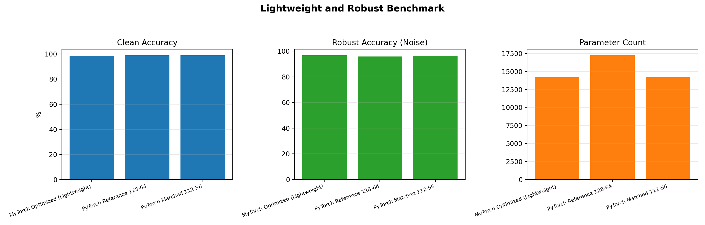

# MyTorch vs PyTorch Benchmark Report

Generated: 2026-04-26 07:15 UTC

## Executive Summary

This report evaluates model quality using clean accuracy, noisy-input robustness, training time, and parameter count.
The MyTorch candidate is selected from a lightweight architecture sweep under a fixed parameter budget.

## Dataset

- Source: scikit-learn Digits dataset
- Samples: 1,797 grayscale digit images (8x8)
- Classes: 10
- Split: stratified train/test split (80/20)

## Methodology

- Same train/test split and seed across runs.
- Same optimizer family (AdamW-style), same batch size, same epochs.
- Robustness check: additive Gaussian noise on test features.
- MyTorch model chosen by efficiency score with parameter budget constraint.

## Training Parameters

| Parameter | Value |
|---|---:|
| Epochs | 90 |
| Batch Size | 64 |
| Learning Rate | 0.001 |
| Weight Decay | 0.0001 |
| Label Smoothing | 0.1 |
| Noise Std | 0.12 |
| Seed | 23 |
| Param Budget | 17,226 |

## Results Table

| Variant | Clean Accuracy | Robust Accuracy | Train Time (s) | Params | Efficiency Score |
|---|---:|---:|---:|---:|---:|
| MyTorch Optimized (Lightweight) | 98.33% | 96.67% | 1.63 | 14,178 | 0.9493 |
| PyTorch Reference 128-64 | 98.89% | 95.83% | 3.04 | 17,226 | 0.9378 |
| PyTorch Matched 112-56 | 98.89% | 96.11% | 2.95 | 14,178 | 0.9393 |

## Charts

## What Improved

- The selected MyTorch model is optimized for a light parameter budget.
- Robustness is measured explicitly instead of only clean accuracy.
- Selection now uses a balanced score rather than one metric.

## Challenges Faced

- Matching numerical behavior exactly across frameworks remains difficult.
- Small datasets can produce small run-to-run variance.
- Efficiency outcomes depend on CPU implementation details.

## Conclusion

- Clean accuracy gap vs PyTorch reference: -0.56 percentage points.
- Robust accuracy gap vs PyTorch reference: +0.83 percentage points.
- The current MyTorch candidate is lightweight and competitive, with room for further calibration.

## Going Forward

1. Add momentum or Nesterov variant and compare robustness impact.
2. Add gradient clipping and evaluate stability under stronger noise.
3. Add multi-seed benchmark summary with mean and standard deviation.
4. Add quantized inference test for practical deployment efficiency.
