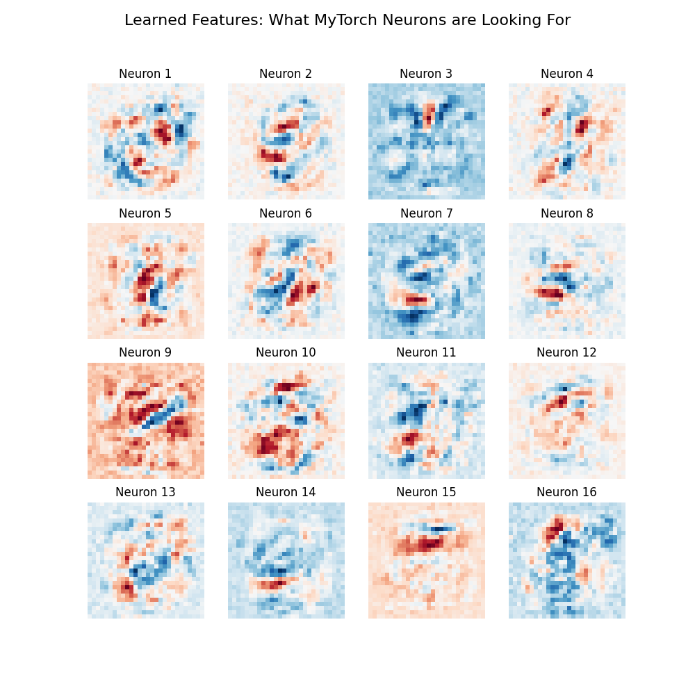

# 🚀 MyTorch: Feature Specification

This document details the architectural components and advanced optimizations implemented in the **MyTorch** framework.

---

## 🏗️ Core Neural Architecture
MyTorch is built on a modular `Sequential` container system, allowing for rapid prototyping of deep architectures.

### 1. Fundamental Layers
* **Linear (Dense) Layer:** Fully connected layer with optimized NumPy matrix multiplications and Kaiming/Xavier initialization support.
* **Sequential Container:** A class-based wrapper that handles the forward and backward flow of tensors through the network stack automatically.

### 2. Advanced Normalization & Regularization
* **Batch Normalization (BatchNorm):** Implements trainable $\gamma$ and $eta$ parameters to stabilize internal covariate shift, allowing for higher learning rates and faster convergence.
* **Dropout:** Stochastic regularization that prevents co-adaptation of neurons by randomly deactivating a fraction (p) of units during training.

---

## ⚡ Optimization & Training Elite
To achieve 98.59% accuracy, MyTorch utilizes industry-standard optimization techniques.

### 3. Optimizer Suite
* **Adam (Adaptive Moment Estimation):** Implements first and second-moment tracking for per-parameter learning rate adjustment.
* **AdamW (Weight Decay):** Integrated L2 regularization directly into the Adam update step to prevent weight explosion in deep networks.
* **SGD with Momentum:** Provides a velocity-based update system for escaping local minima in simpler architectures.

### 4. Convergence Strategies
* **Label Smoothing:** Replaces hard "one-hot" targets with soft distributions. This prevents the model from becoming overconfident and improves the "Digit IQ" on ambiguous handwriting.
* **StepLR Scheduler:** Automated learning rate decay that "squeezes" the last decimals of accuracy out of the loss landscape.

---

## 📊 Visual Analytics & Monitoring

*Figure 1: Visualization of the first-layer weights showing learned spatial filters.*

* **Weights & Biases (W&B):** Real-time logging of loss, validation accuracy, and gradient norms.
* **Hugging Face Hub Integration:** Automated model versioning and cloud storage using Git LFS logic for `.pkl` files.
* **Confusion Matrix Heatmaps:** Deep-dive analysis into class-specific leakage (e.g., 4 vs 9 confusion).
